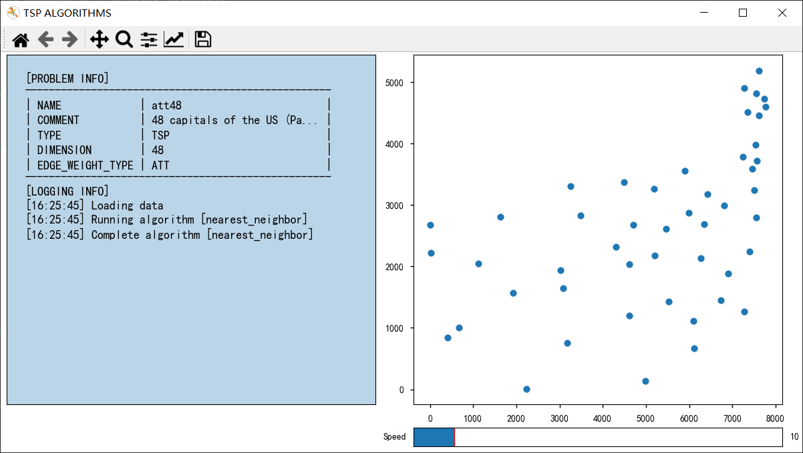

# TSP Algorithms

> Thanks for the inspired project https://github.com/afourmy/pyTSP :stuck_out_tongue_winking_eye:

## Introduction

1. Definition

   The traveling salesman problem (also called the travelling salesperson prob-em or TSP) asks the following
   question: _"Given a list of cities and the distances between each pair of cities, what is the shortest possible route
   that visits each city exactly once and returns to the origin city?"_ It is an **NP-hard** problem in combinatorial
   optimization, important in theoretical computer science and operations research.

2. Origin

   The origin of TSP lies with Hamilton's Icosian Game, which was a recreational puzzle based on finding a Hamiltonian
   cycle.

3. Background

   The TSP has several applications even in its purest formulation, such as p-lanning, logistics, and the manufacture of
   microchips. Slightly modified, it appears as a sub-problem in many areas, such as DNA sequencing. In these
   applications, the concept city represents, for example, customers, soldering points, or DNA fragments, and the
   concept distance represents travelling times or cost, or a similarity measure between DNA fragments. The TSP also
   appears in astronomy, as astronomers observing many sources will want to minimize the ti-me spent moving the
   telescope between the sources; in such problems, the TSP can be embedded inside an optimal control problem. In many
   applications, additional constraints such as limited resources or time windows may be imposed.

## Main Work

- :keyboard: Reproduced and compared some TSP Algorithms in Python. (source/algorithms/)

- :+1: An interactive GUI based on matplotlib to show the process of the algorithm.
  (tsp.py, source/commons/plotter.py)

- :magnet: Implemented a more generic script that can be used to load tsplib files
  (source/commons/tsplib_loader.py)

## Get Started

1. Install

   The easiest way to prepare the environment with all required packages is to use pypi.

    ```shell
    pip install -r requirements.txt
    ```

2. Run Alogorihm

   The tsplib data provided is in the data/TSP.

   Use it like this:
   ```shell
    python tsp.py burma14 -alg ilp_solver
    python tsp.py att48 -alg nearest_neighbor pairwise_exchange ilp_solver genetic
   ```
   See details:
    ```shell
    python tsp.py -h
    ```

## Algorithms

1. Overview The traditional lines of attack for the NP-hard problems are the following:

    - Devising exact algorithms, which work reasonably fast only for small problem sizes.
    - Devising "sub optimal" or heuristic algorithms, i.e., algorithms that deliver approximated solutions in a
      reasonable time.
    - Finding special cases for the problem ("sub problems") for which either better or exact heuristics are possible.

2. Details

   We take constructive heuristics algorithm as an example:

   The nearest neighbour (NN) algorithm (a greedy algorithm) lets the salesman choose the nearest unvisited city as his
   next move. This algorithm quickly yields an effectively short route. For N cities randomly distributed on a plane,
   the algorithm on average yields a path 25% longer than the shortest possible path. <br/>

   However, there exist many specially arranged city distributions which make the NN algorithm give the worst route.
   This is true for both asymmetric and symmetric TSPs. Rosenkrantz showed that the NN algorithm h-as the approximation
   factor for instances satisfying the triangle inequality. A variation of NN algorithm, called Nearest Fragment (NF)
   operator, which connects a group (fragment) of nearest unvisited cities, can find shorter routes with successive
   iterations. The NF operator can also be applied on an initial solution obtained by NN algorithm for further
   improvement in an elitist model, where only better solutions are accepted.

## Implementation

### 1. Construction heuristics

#### 1.1 Nearest neighbor <br/>

> ① Start from a random city. <br/>
> ② Travel to the nearest unvisited city. <br/>
> ③ Repeat until every city has been visited.



#### 1.2 Nearest insertion

> ① Start from a random city. <br/>
> ② Find the city closest to the partial tour, i.e the city i which minimizes d(i, j) with j a city already in the
> tour. <br/>
> ③ Insert i before or after j, depending on which option is shorter. <br/>
> ④ Repeat until every city has been visited.


#### 1.3 Cheapest insertion

> ① Start from a random city. <br/>
> ② Find the city which insertion in the tour causes the smallest increase in length,i.e the city k which minimizes
> d(i, k) + d(k, j) - d(i, j) with (i, j) an edge in the partial tour. <br/>
> ③ Insert k between i and j. <br/>
> ④ Repeat until every city has been visited.


#### 1.4 Farthest insertion

> ① Start from a random city. <br/>
> ② Find the city k farthest from any node in the tour (i.e the city k which maximizes d(c, k) with c a city in the
> partial tour), and insert k where it causes the smallest increase in length (by minimizing d(i, k) + d(k, j) -
> d(i, j), with (i, j) an edge in the partial tour). <br/>
> ③ Repeat until every city has been visited.


### 2. Linear programming


Note: there is an exponentially growing number of subtour constraints, which makes this algorithm inefficient for larger
instances of the TSP. One way to improve it is to use lazy constraints, i.e ignore the subtour constraints and eliminate
them one by one when looking for a feasible solution.


### 3. Optimization heuristics

#### 3.1 Pairwise exchange (2-opt)

① Given a pair of edges, there is only one way of deleting and reconnecting the edges to obtain a valid tour. If this
new tour is shorter, make the change. <br>
② Repeat for any pair of edges until no further improvement can be made.


#### 3.2 Node insertion

① Given a node, remove it from the tour and insert it at the best possible position. <br>
② Repeat for any node until no further improvement can be made.


#### 3.3 Edge insertion

① Given an edge, remove it from the tour and insert it at the best possible position. <br>
② Repeat for any edge until no further improvement can be made.


### 4. Genetic algorithm

Genetic algorithms are a whole new class of Algorithms which mimic nature and evolution.They follow Darwin's theory of
survival of the fittest.And they are randomized algorithms and may not find best solution.Using Genetic algorithms we
can easily solve problems of size less than 100. Implemented a genetic algorithm with the following properties:
① 3 mutation methods: random swap, insertion or displacement. <br>
② 3 crossover methods: order, maximally preservative, or partially mapped. <br>
③ Selection: at each generation, 30 individuals are chosen randomly, and the 10 best are kept for the next
generation. <br>
④ Mutation and crossover rates default to 50%. They can be modified with sliders.

Note: the genetic algorithm is processed by the server, and websockets (or long-polling if the server does not support
websockets) are used to update the display client-side every new generation.


## Reference

* https://en.wikipedia.org/wiki/Travelling_salesman_problem
* The Traveling Salesman Problem (1985)- Lawler, Lenstra, Rinnoooy Kan, Shmoys
* The Traveling Salesman Problem and its Variations (2002)- Gutin, Punnen The Traveling Salesman Problem:
  A Computational Study (2006) - Applegate, Bixby, Chvatal, Cook

  > [Benchmark TSPLIB Instances](http://dimacs.rutgers.edu/archive/Challenges/TSP/download.html) <br>
  > About 98 files are available for the presentation of algorithm